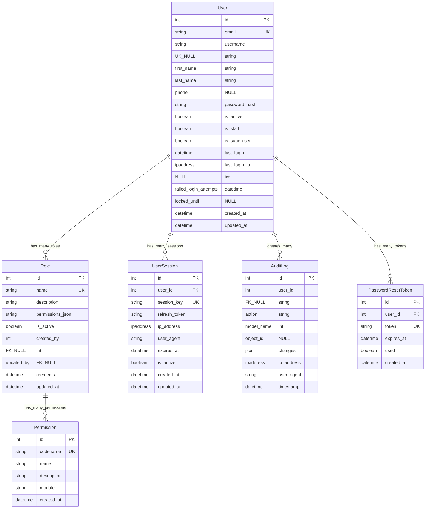

# iKodio ERP - Entity Relationship Diagram (ERD)

**Version:** 1.0  
**Date:** November 3, 2025  
**Total Models:** 70+ models across 9 business modules

---

## Table of Contents

1. [Overview](#overview)
2. [Module Summary](#module-summary)
3. [Core Module (Base Models)](#core-module-base-models)
4. [Authentication Module](#authentication-module)
5. [HR Module](#hr-module)
6. [Project Module](#project-module)
7. [Finance Module](#finance-module)
8. [CRM Module](#crm-module)
9. [Asset Module](#asset-module)
10. [Helpdesk Module](#helpdesk-module)
11. [DMS Module](#dms-module)
12. [Analytics Module](#analytics-module)
13. [Inter-Module Relationships](#inter-module-relationships)
14. [Database Indexes](#database-indexes)

---

## Overview

The iKodio ERP system consists of **70+ database models** organized into **9 business modules** plus **1 core module** for shared functionality. All models inherit from base models that provide common fields like timestamps, soft delete, and audit trail.

### Database Technology
- **RDBMS:** PostgreSQL 15+
- **ORM:** Django ORM
- **Total Tables:** 70+
- **Foreign Key Constraints:** 150+
- **Indexes:** 50+ custom indexes

---

## Module Summary

| # | Module | Models | Tables | Description |
|---|--------|--------|--------|-------------|
| 0 | **Core** | 3 | 3 | Base abstract models (TimeStamped, SoftDelete, Audit) |
| 1 | **Authentication** | 6 | 6 | User management, RBAC, audit logging |
| 2 | **HR** | 8 | 8 | Employee lifecycle, attendance, payroll, performance |
| 3 | **Project** | 8 | 8 | Project management, tasks, sprints, timesheets |
| 4 | **Finance** | 11 | 11 | GL, invoicing, payments, budgets, taxes |
| 5 | **CRM** | 7 | 7 | Clients, leads, opportunities, contracts |
| 6 | **Asset** | 9 | 9 | Asset tracking, procurement, maintenance, licenses |
| 7 | **Helpdesk** | 7 | 7 | Ticketing, SLA, knowledge base, escalation |
| 8 | **DMS** | 7 | 7 | Document management, versioning, approvals |
| 9 | **Analytics** | 8 | 8 | Dashboards, reports, KPIs, data exports |
| **TOTAL** | **10** | **74** | **74** | Complete ERP system |

---

## Core Module (Base Models)

### Abstract Base Models

All models in the system inherit from these base classes to ensure consistency:

```python
# Base Abstract Models (not actual database tables)

TimeStampedModel (Abstract):
├── created_at: DateTimeField (auto_now_add)
└── updated_at: DateTimeField (auto_now)

SoftDeleteModel (Abstract):
├── deleted_at: DateTimeField (null, blank)
└── deleted_by: ForeignKey(User, null, blank)

AuditModel (Abstract):
├── created_by: ForeignKey(User, null, blank)
└── updated_by: ForeignKey(User, null, blank)
```

---

## Authentication Module

### Models (6 total)



---

## HR Module

### Models (8 total)

```mermaid
erDiagram
    Employee ||--o{ Attendance : records_many
    Employee ||--o{ Leave : requests_many
    Employee ||--o{ LeaveBalance : has_many_balances
    Employee ||--o{ Payroll : receives_many_payrolls
    Employee ||--o{ PerformanceReview : receives_many_reviews
    Employee ||--|| Department : belongs_to
    Employee ||--|| Position : has_position
    Employee ||--|| User : linked_to
    Employee ||--o| Employee : reports_to
    Department ||--o| Department : parent_department
    
    Employee {
        int id PK
        int user_id FK_UK
        string employee_id UK
        string first_name
        string last_name
        string email UK
        string phone
        int department_id FK
        int position_id FK
        int reports_to_id FK_NULL
        date hire_date
        date termination_date NULL
        string employment_type
        string employment_status
        decimal salary
        string tax_id
        string bank_account
        string address
        string emergency_contact
        string emergency_phone
        datetime created_at
        datetime updated_at
        datetime deleted_at NULL
        int created_by FK_NULL
        int updated_by FK_NULL
        int deleted_by FK_NULL
    }
    
    Department {
        int id PK
        string name UK
        string code UK
        string description
        int parent_id FK_NULL
        int manager_id FK_NULL
        decimal budget
        boolean is_active
        datetime created_at
        datetime updated_at
        datetime deleted_at NULL
        int created_by FK_NULL
        int updated_by FK_NULL
        int deleted_by FK_NULL
    }
    
    Position {
        int id PK
        string title UK
        string code UK
        string description
        int department_id FK
        string level
        decimal min_salary
        decimal max_salary
        boolean is_active
        datetime created_at
        datetime updated_at
        datetime deleted_at NULL
        int created_by FK_NULL
        int updated_by FK_NULL
        int deleted_by FK_NULL
    }
    
    Attendance {
        int id PK
        int employee_id FK
        date date
        time check_in NULL
        time check_out NULL
        decimal hours_worked
        string status
        string notes
        ipaddress check_in_ip NULL
        ipaddress check_out_ip NULL
        datetime created_at
        datetime updated_at
    }
    
    Leave {
        int id PK
        int employee_id FK
        string leave_type
        date start_date
        date end_date
        int days_count
        string reason
        string status
        int approved_by FK_NULL
        datetime approved_at NULL
        string rejection_reason NULL
        datetime created_at
        datetime updated_at
        datetime deleted_at NULL
        int created_by FK_NULL
        int updated_by FK_NULL
        int deleted_by FK_NULL
    }
    
    LeaveBalance {
        int id PK
        int employee_id FK
        int year
        string leave_type
        int total_days
        int used_days
        int remaining_days
        datetime created_at
        datetime updated_at
    }
    
    Payroll {
        int id PK
        int employee_id FK
        int year
        int month
        decimal basic_salary
        decimal allowances
        decimal deductions
        decimal bonuses
        decimal overtime_pay
        decimal tax
        decimal net_salary
        string status
        date payment_date NULL
        string payment_method
        string notes
        datetime created_at
        datetime updated_at
        datetime deleted_at NULL
        int created_by FK_NULL
        int updated_by FK_NULL
        int deleted_by FK_NULL
    }
    
    PerformanceReview {
        int id PK
        int employee_id FK
        int reviewer_id FK
        int year
        int quarter
        decimal rating
        text strengths
        text areas_for_improvement
        text goals
        string status
        date review_date
        datetime created_at
        datetime updated_at
        datetime deleted_at NULL
        int created_by FK_NULL
        int updated_by FK_NULL
        int deleted_by FK_NULL
    }
```

---

## Project Module

### Models (8 total)

```mermaid
erDiagram
    Project ||--o{ ProjectTeamMember : has_many_members
    Project ||--o{ Task : has_many_tasks
    Project ||--o{ Sprint : has_many_sprints
    Project ||--o{ ProjectMilestone : has_many_milestones
    Project ||--o{ ProjectRisk : has_many_risks
    Project ||--|| Client : belongs_to_client
    Project ||--|| Employee : managed_by
    Task ||--o{ TaskComment : has_many_comments
    Task ||--o{ Timesheet : has_many_timesheets
    Task ||--o| Sprint : belongs_to_sprint
    Task ||--o| Task : parent_task
    Task ||--|| Employee : assigned_to
    
    Project {
        int id PK
        string name
        string code UK
        int client_id FK
        int project_manager_id FK
        string status
        string priority
        date start_date
        date end_date NULL
        decimal budget
        decimal actual_cost
        decimal progress_percentage
        file contract_document NULL
        text description
        string tags
        string category
        text notes
        datetime created_at
        datetime updated_at
        datetime deleted_at NULL
        int created_by FK_NULL
        int updated_by FK_NULL
        int deleted_by FK_NULL
    }
    
    ProjectTeamMember {
        int id PK
        int project_id FK
        int employee_id FK
        string role
        decimal allocation_percentage
        date start_date
        date end_date NULL
        boolean is_active
        datetime created_at
        datetime updated_at
    }
    
    Task {
        int id PK
        int project_id FK
        int sprint_id FK_NULL
        int parent_task_id FK_NULL
        string title
        text description
        int assigned_to FK_NULL
        string priority
        string status
        int estimated_hours
        int actual_hours
        date start_date NULL
        date due_date NULL
        date completed_date NULL
        int progress_percentage
        string tags
        datetime created_at
        datetime updated_at
        datetime deleted_at NULL
        int created_by FK_NULL
        int updated_by FK_NULL
        int deleted_by FK_NULL
    }
    
    Sprint {
        int id PK
        int project_id FK
        string name
        string goal
        date start_date
        date end_date
        string status
        int velocity
        datetime created_at
        datetime updated_at
        datetime deleted_at NULL
        int created_by FK_NULL
        int updated_by FK_NULL
        int deleted_by FK_NULL
    }
    
    Timesheet {
        int id PK
        int task_id FK
        int employee_id FK
        date work_date
        decimal hours_worked
        text description
        boolean is_billable
        string status
        int approved_by FK_NULL
        datetime approved_at NULL
        datetime created_at
        datetime updated_at
        datetime deleted_at NULL
        int created_by FK_NULL
        int updated_by FK_NULL
        int deleted_by FK_NULL
    }
    
    ProjectMilestone {
        int id PK
        int project_id FK
        string name
        text description
        date due_date
        date completion_date NULL
        string status
        int completion_percentage
        datetime created_at
        datetime updated_at
        datetime deleted_at NULL
        int created_by FK_NULL
        int updated_by FK_NULL
        int deleted_by FK_NULL
    }
    
    TaskComment {
        int id PK
        int task_id FK
        int user_id FK
        text comment
        datetime created_at
        datetime updated_at
    }
    
    ProjectRisk {
        int id PK
        int project_id FK
        string title
        text description
        string risk_level
        string impact
        string probability
        string mitigation_plan
        string status
        int owner_id FK
        datetime created_at
        datetime updated_at
        datetime deleted_at NULL
        int created_by FK_NULL
        int updated_by FK_NULL
        int deleted_by FK_NULL
    }
```

---

## Finance Module

### Models (11 total)

```mermaid
erDiagram
    Invoice ||--o{ Payment : receives_many_payments
    Invoice ||--|| Client : billed_to
    Expense ||--|| Employee : submitted_by
    Budget ||--|| Department : allocated_to
    GeneralLedger ||--|| JournalEntry : related_to
    JournalEntry ||--o{ GeneralLedger : has_many_entries
    Tax ||--o{ Invoice : applied_to_many
    
    Invoice {
        int id PK
        string invoice_number UK
        int client_id FK
        date invoice_date
        date due_date
        decimal subtotal
        decimal tax_amount
        decimal discount_amount
        decimal total_amount
        decimal paid_amount
        decimal balance
        string status
        string payment_terms
        text notes
        file attachment NULL
        datetime created_at
        datetime updated_at
        datetime deleted_at NULL
        int created_by FK_NULL
        int updated_by FK_NULL
        int deleted_by FK_NULL
    }
    
    Payment {
        int id PK
        string payment_number UK
        int invoice_id FK
        decimal amount
        date payment_date
        string payment_method
        string transaction_reference
        string status
        text notes
        datetime created_at
        datetime updated_at
        datetime deleted_at NULL
        int created_by FK_NULL
        int updated_by FK_NULL
        int deleted_by FK_NULL
    }
    
    Expense {
        int id PK
        string expense_number UK
        int employee_id FK
        string category
        decimal amount
        date expense_date
        string description
        file receipt NULL
        string status
        int approved_by FK_NULL
        datetime approved_at NULL
        text rejection_reason NULL
        datetime created_at
        datetime updated_at
        datetime deleted_at NULL
        int created_by FK_NULL
        int updated_by FK_NULL
        int deleted_by FK_NULL
    }
    
    Budget {
        int id PK
        string name
        int department_id FK_NULL
        int fiscal_year
        int quarter NULL
        decimal allocated_amount
        decimal spent_amount
        decimal remaining_amount
        string status
        text notes
        datetime created_at
        datetime updated_at
        datetime deleted_at NULL
        int created_by FK_NULL
        int updated_by FK_NULL
        int deleted_by FK_NULL
    }
    
    GeneralLedger {
        int id PK
        string account_code UK
        string account_name
        string account_type
        decimal debit
        decimal credit
        decimal balance
        date transaction_date
        string description
        int journal_entry_id FK_NULL
        datetime created_at
        datetime updated_at
    }
    
    JournalEntry {
        int id PK
        string entry_number UK
        date entry_date
        string entry_type
        text description
        decimal total_debit
        decimal total_credit
        string status
        int posted_by FK_NULL
        datetime posted_at NULL
        datetime created_at
        datetime updated_at
        datetime deleted_at NULL
        int created_by FK_NULL
        int updated_by FK_NULL
        int deleted_by FK_NULL
    }
    
    Tax {
        int id PK
        string name UK
        string tax_code UK
        decimal rate
        string tax_type
        boolean is_active
        text description
        datetime created_at
        datetime updated_at
        datetime deleted_at NULL
        int created_by FK_NULL
        int updated_by FK_NULL
        int deleted_by FK_NULL
    }
    
    BankAccount {
        int id PK
        string account_name
        string account_number UK
        string bank_name
        string account_type
        decimal balance
        string currency
        boolean is_active
        datetime created_at
        datetime updated_at
    }
    
    BankTransaction {
        int id PK
        int bank_account_id FK
        string transaction_type
        decimal amount
        date transaction_date
        string description
        string reference_number
        decimal balance_after
        datetime created_at
    }
    
    AccountsReceivable {
        int id PK
        int invoice_id FK
        int client_id FK
        decimal amount
        date due_date
        string status
        int aging_days
        datetime created_at
        datetime updated_at
    }
    
    AccountsPayable {
        int id PK
        string bill_number UK
        int vendor_id FK
        decimal amount
        date bill_date
        date due_date
        string status
        text description
        datetime created_at
        datetime updated_at
    }
```

---

## CRM Module

### Models (7 total)

```mermaid
erDiagram
    Client ||--o{ Lead : has_many_leads
    Client ||--o{ Opportunity : has_many_opportunities
    Client ||--o{ Contract : has_many_contracts
    Client ||--o{ Quotation : receives_many_quotations
    Client ||--o{ FollowUp : has_many_followups
    Lead ||--o| Opportunity : converts_to
    Opportunity ||--o| Contract : converts_to
    Quotation ||--o{ QuotationLine : has_many_lines
    
    Client {
        int id PK
        string name
        string company_name
        string email UK
        string phone
        string address
        string city
        string country
        string industry
        string client_type
        string status
        decimal credit_limit
        text notes
        datetime created_at
        datetime updated_at
        datetime deleted_at NULL
        int created_by FK_NULL
        int updated_by FK_NULL
        int deleted_by FK_NULL
    }
    
    Lead {
        int id PK
        string name
        string company
        string email
        string phone
        string source
        string status
        int assigned_to FK_NULL
        text notes
        int client_id FK_NULL
        datetime converted_at NULL
        datetime created_at
        datetime updated_at
        datetime deleted_at NULL
        int created_by FK_NULL
        int updated_by FK_NULL
        int deleted_by FK_NULL
    }
    
    Opportunity {
        int id PK
        string name
        int client_id FK
        int lead_id FK_NULL
        decimal estimated_value
        string stage
        int probability
        date expected_close_date
        int assigned_to FK_NULL
        string status
        text description
        datetime won_at NULL
        datetime lost_at NULL
        text lost_reason NULL
        datetime created_at
        datetime updated_at
        datetime deleted_at NULL
        int created_by FK_NULL
        int updated_by FK_NULL
        int deleted_by FK_NULL
    }
    
    Contract {
        int id PK
        string contract_number UK
        int client_id FK
        int opportunity_id FK_NULL
        string contract_type
        date start_date
        date end_date
        decimal contract_value
        string status
        file contract_file NULL
        text terms_and_conditions
        int signed_by FK_NULL
        datetime signed_at NULL
        datetime created_at
        datetime updated_at
        datetime deleted_at NULL
        int created_by FK_NULL
        int updated_by FK_NULL
        int deleted_by FK_NULL
    }
    
    Quotation {
        int id PK
        string quotation_number UK
        int client_id FK
        date issue_date
        date expiry_date
        decimal subtotal
        decimal tax_amount
        decimal discount_amount
        decimal total_amount
        string status
        text terms_and_conditions
        text notes
        datetime sent_at NULL
        datetime accepted_at NULL
        datetime created_at
        datetime updated_at
        datetime deleted_at NULL
        int created_by FK_NULL
        int updated_by FK_NULL
        int deleted_by FK_NULL
    }
    
    QuotationLine {
        int id PK
        int quotation_id FK
        string description
        int quantity
        decimal unit_price
        decimal discount_percentage
        decimal total_price
        datetime created_at
        datetime updated_at
    }
    
    FollowUp {
        int id PK
        int client_id FK
        int lead_id FK_NULL
        int opportunity_id FK_NULL
        datetime scheduled_date
        string follow_up_type
        text notes
        string status
        int assigned_to FK_NULL
        datetime completed_at NULL
        datetime created_at
        datetime updated_at
        datetime deleted_at NULL
        int created_by FK_NULL
        int updated_by FK_NULL
        int deleted_by FK_NULL
    }
```

---

## Asset Module

### Models (9 total)

```mermaid
erDiagram
    Asset ||--|| AssetCategory : belongs_to
    Asset ||--o| Vendor : purchased_from
    Asset ||--o| Employee : assigned_to
    Asset ||--o{ AssetMaintenance : has_many_maintenances
    Asset ||--o{ AssetAssignment : has_many_assignments
    AssetCategory ||--o| AssetCategory : parent_category
    Procurement ||--o{ ProcurementLine : has_many_lines
    Procurement ||--|| Vendor : from_vendor
    License ||--|| Asset : for_asset
    
    Asset {
        int id PK
        string asset_tag UK
        string name
        int category_id FK
        string asset_type
        string serial_number UK_NULL
        int vendor_id FK_NULL
        date purchase_date NULL
        decimal purchase_cost
        decimal current_value
        string status
        int assigned_to FK_NULL
        date warranty_expiry_date NULL
        string location
        text specifications
        text notes
        datetime created_at
        datetime updated_at
        datetime deleted_at NULL
        int created_by FK_NULL
        int updated_by FK_NULL
        int deleted_by FK_NULL
    }
    
    AssetCategory {
        int id PK
        string name UK
        string code UK
        text description
        int parent_id FK_NULL
        boolean is_active
        datetime created_at
        datetime updated_at
        datetime deleted_at NULL
        int created_by FK_NULL
        int updated_by FK_NULL
        int deleted_by FK_NULL
    }
    
    Vendor {
        int id PK
        string name UK
        string contact_person
        string email
        string phone
        string address
        string city
        string country
        string vendor_type
        string status
        text notes
        datetime created_at
        datetime updated_at
        datetime deleted_at NULL
        int created_by FK_NULL
        int updated_by FK_NULL
        int deleted_by FK_NULL
    }
    
    Procurement {
        int id PK
        string procurement_number UK
        int vendor_id FK
        date request_date
        date order_date NULL
        date delivery_date NULL
        decimal total_amount
        string status
        string priority
        text description
        int requested_by FK
        int approved_by FK_NULL
        datetime approved_at NULL
        datetime created_at
        datetime updated_at
        datetime deleted_at NULL
        int created_by FK_NULL
        int updated_by FK_NULL
        int deleted_by FK_NULL
    }
    
    ProcurementLine {
        int id PK
        int procurement_id FK
        string item_name
        text description
        int quantity
        decimal unit_price
        decimal total_price
        datetime created_at
        datetime updated_at
    }
    
    AssetMaintenance {
        int id PK
        int asset_id FK
        string maintenance_type
        date scheduled_date
        date completed_date NULL
        decimal cost
        int vendor_id FK_NULL
        string status
        text description
        text notes
        datetime created_at
        datetime updated_at
        datetime deleted_at NULL
        int created_by FK_NULL
        int updated_by FK_NULL
        int deleted_by FK_NULL
    }
    
    AssetAssignment {
        int id PK
        int asset_id FK
        int employee_id FK
        date assigned_date
        date return_date NULL
        boolean is_active
        text notes
        datetime created_at
        datetime updated_at
    }
    
    License {
        int id PK
        string license_key UK
        string software_name
        int asset_id FK_NULL
        int vendor_id FK_NULL
        string license_type
        int seats
        int seats_used
        date purchase_date
        date expiry_date
        decimal cost
        string status
        text notes
        datetime created_at
        datetime updated_at
        datetime deleted_at NULL
        int created_by FK_NULL
        int updated_by FK_NULL
        int deleted_by FK_NULL
    }
    
    DepreciationSchedule {
        int id PK
        int asset_id FK
        int year
        int month
        decimal opening_value
        decimal depreciation_amount
        decimal closing_value
        string depreciation_method
        datetime created_at
    }
```

---

## Helpdesk Module

### Models (7 total)

```mermaid
erDiagram
    Ticket ||--o{ TicketComment : has_many_comments
    Ticket ||--o{ TicketEscalation : has_many_escalations
    Ticket ||--o| SLAPolicy : follows_sla
    Ticket ||--|| Employee : requested_by
    Ticket ||--o| Employee : assigned_to
    Ticket ||--o| Asset : related_to_asset
    Ticket ||--o| Project : related_to_project
    KnowledgeBase ||--|| Category : belongs_to_category
    TicketTemplate ||--|| Category : for_category
    
    Ticket {
        int id PK
        string ticket_number UK
        string subject
        text description
        int requester_id FK
        int assigned_to FK_NULL
        string priority
        string status
        string category
        int sla_policy_id FK_NULL
        datetime sla_response_due NULL
        datetime sla_resolution_due NULL
        datetime first_response_at NULL
        datetime resolved_at NULL
        int related_asset_id FK_NULL
        int related_project_id FK_NULL
        text resolution
        int rating NULL
        text feedback NULL
        datetime created_at
        datetime updated_at
        datetime deleted_at NULL
        int created_by FK_NULL
        int updated_by FK_NULL
        int deleted_by FK_NULL
    }
    
    TicketComment {
        int id PK
        int ticket_id FK
        int user_id FK
        text comment
        boolean is_internal
        file attachment NULL
        datetime created_at
        datetime updated_at
    }
    
    SLAPolicy {
        int id PK
        string name UK
        string priority
        int response_time_hours
        int resolution_time_hours
        boolean is_active
        text description
        datetime created_at
        datetime updated_at
        datetime deleted_at NULL
        int created_by FK_NULL
        int updated_by FK_NULL
        int deleted_by FK_NULL
    }
    
    TicketEscalation {
        int id PK
        int ticket_id FK
        int escalated_from FK_NULL
        int escalated_to FK
        string reason
        text notes
        datetime escalated_at
        datetime resolved_at NULL
        datetime created_at
    }
    
    KnowledgeBase {
        int id PK
        string title
        string category
        text content
        string tags
        int views
        int helpful_count
        int not_helpful_count
        boolean is_published
        datetime published_at NULL
        datetime created_at
        datetime updated_at
        datetime deleted_at NULL
        int created_by FK_NULL
        int updated_by FK_NULL
        int deleted_by FK_NULL
    }
    
    TicketTemplate {
        int id PK
        string name UK
        string category
        text description
        text default_resolution
        boolean is_active
        datetime created_at
        datetime updated_at
        datetime deleted_at NULL
        int created_by FK_NULL
        int updated_by FK_NULL
        int deleted_by FK_NULL
    }
    
    CustomerFeedback {
        int id PK
        int ticket_id FK
        int rating
        text feedback
        text improvement_suggestions
        datetime created_at
    }
```

---

## DMS Module

### Models (7 total)

```mermaid
erDiagram
    Document ||--o{ DocumentVersion : has_many_versions
    Document ||--o{ DocumentApproval : requires_many_approvals
    Document ||--o{ DocumentAccess : has_many_access_rules
    Document ||--o{ DocumentActivity : has_many_activities
    Document ||--|| DocumentCategory : belongs_to
    Document ||--o| DocumentTemplate : created_from
    DocumentCategory ||--o| DocumentCategory : parent_category
    
    Document {
        int id PK
        string title
        int category_id FK
        string document_type
        file file
        string file_name
        decimal file_size
        string version
        string status
        text description
        string tags
        boolean requires_signature
        datetime signed_at NULL
        int signed_by FK_NULL
        int template_id FK_NULL
        datetime created_at
        datetime updated_at
        datetime deleted_at NULL
        int created_by FK_NULL
        int updated_by FK_NULL
        int deleted_by FK_NULL
    }
    
    DocumentCategory {
        int id PK
        string name UK
        string code UK
        text description
        int parent_id FK_NULL
        boolean is_active
        datetime created_at
        datetime updated_at
        datetime deleted_at NULL
        int created_by FK_NULL
        int updated_by FK_NULL
        int deleted_by FK_NULL
    }
    
    DocumentVersion {
        int id PK
        int document_id FK
        string version_number
        file file
        decimal file_size
        text change_description
        datetime created_at
        int created_by FK
    }
    
    DocumentApproval {
        int id PK
        int document_id FK
        int approver_id FK
        int approval_order
        string status
        text comments
        datetime approved_at NULL
        datetime rejected_at NULL
        datetime created_at
        datetime updated_at
    }
    
    DocumentAccess {
        int id PK
        int document_id FK
        int user_id FK_NULL
        int role_id FK_NULL
        string access_level
        datetime expires_at NULL
        datetime created_at
        int created_by FK
    }
    
    DocumentTemplate {
        int id PK
        string name UK
        int category_id FK
        file template_file
        text description
        boolean is_active
        datetime created_at
        datetime updated_at
        datetime deleted_at NULL
        int created_by FK_NULL
        int updated_by FK_NULL
        int deleted_by FK_NULL
    }
    
    DocumentActivity {
        int id PK
        int document_id FK
        int user_id FK
        string activity_type
        text description
        datetime created_at
    }
```

---

## Analytics Module

### Models (8 total)

```mermaid
erDiagram
    Dashboard ||--o{ Widget : has_many_widgets
    Report ||--o{ ReportExecution : has_many_executions
    KPI ||--o{ KPIValue : has_many_values
    SavedFilter ||--|| User : owned_by
    
    Dashboard {
        int id PK
        string name
        text description
        string layout_config
        boolean is_default
        boolean is_shared
        int order
        datetime created_at
        datetime updated_at
        datetime deleted_at NULL
        int created_by FK_NULL
        int updated_by FK_NULL
        int deleted_by FK_NULL
    }
    
    Widget {
        int id PK
        int dashboard_id FK
        string name
        string widget_type
        string data_source
        json query_config
        json display_config
        int order
        boolean is_active
        datetime created_at
        datetime updated_at
    }
    
    Report {
        int id PK
        string name UK
        text description
        string report_type
        string data_source
        json query_config
        json parameters
        string output_format
        boolean is_scheduled
        string schedule_cron NULL
        datetime last_run NULL
        datetime created_at
        datetime updated_at
        datetime deleted_at NULL
        int created_by FK_NULL
        int updated_by FK_NULL
        int deleted_by FK_NULL
    }
    
    KPI {
        int id PK
        string name UK
        text description
        string metric_type
        string unit
        decimal target_value
        string frequency
        string calculation_method
        boolean is_active
        datetime created_at
        datetime updated_at
        datetime deleted_at NULL
        int created_by FK_NULL
        int updated_by FK_NULL
        int deleted_by FK_NULL
    }
    
    KPIValue {
        int id PK
        int kpi_id FK
        date date
        decimal actual_value
        decimal target_value
        decimal variance
        datetime created_at
    }
    
    DataExport {
        int id PK
        string export_name
        string export_type
        json query_config
        file export_file NULL
        string status
        datetime started_at
        datetime completed_at NULL
        int record_count NULL
        datetime created_at
        int created_by FK
    }
    
    SavedFilter {
        int id PK
        string name
        string module
        string view_name
        json filter_config
        boolean is_default
        datetime created_at
        datetime updated_at
        int created_by FK
    }
    
    ReportExecution {
        int id PK
        int report_id FK
        datetime execution_start
        datetime execution_end NULL
        string status
        file output_file NULL
        int record_count NULL
        text error_message NULL
        datetime created_at
        int executed_by FK
    }
```

---

## Inter-Module Relationships

### Cross-Module Foreign Keys

The system has extensive integration between modules through foreign key relationships:

#### **Project → CRM**
- `Project.client_id` → `Client.id`
- Enables project billing and client management

#### **Project → HR**
- `Project.project_manager_id` → `Employee.id`
- `ProjectTeamMember.employee_id` → `Employee.id`
- `Task.assigned_to` → `Employee.id`
- `Timesheet.employee_id` → `Employee.id`

#### **Finance → CRM**
- `Invoice.client_id` → `Client.id`
- Enables automated billing from contracts

#### **Finance → HR**
- `Expense.employee_id` → `Employee.id`
- `Payroll.employee_id` → `Employee.id`
- `Budget.department_id` → `Department.id`

#### **Asset → HR**
- `Asset.assigned_to` → `Employee.id`
- `AssetAssignment.employee_id` → `Employee.id`
- `Procurement.requested_by` → `Employee.id`

#### **Helpdesk → Asset**
- `Ticket.related_asset_id` → `Asset.id`
- Enables asset-related support tickets

#### **Helpdesk → Project**
- `Ticket.related_project_id` → `Project.id`
- Enables project-related support tickets

#### **Helpdesk → HR**
- `Ticket.requester_id` → `Employee.id`
- `Ticket.assigned_to` → `Employee.id`

#### **All Modules → Authentication**
- All tables have `created_by`, `updated_by`, `deleted_by` → `User.id`
- Comprehensive audit trail

---

## Database Indexes

### Composite Indexes for Performance

```sql
-- Authentication Module
CREATE INDEX idx_user_email_active ON users(email, is_active);
CREATE INDEX idx_user_username_active ON users(username, is_active);
CREATE INDEX idx_audit_log_user_timestamp ON audit_logs(user_id, timestamp);

-- HR Module
CREATE INDEX idx_employee_dept_status ON employees(department_id, employment_status);
CREATE INDEX idx_attendance_employee_date ON attendance(employee_id, date);
CREATE INDEX idx_leave_employee_status ON leaves(employee_id, status);
CREATE INDEX idx_payroll_employee_year_month ON payrolls(employee_id, year, month);

-- Project Module
CREATE INDEX idx_project_client_status ON projects(client_id, status);
CREATE INDEX idx_task_project_status ON tasks(project_id, status);
CREATE INDEX idx_task_assigned_status ON tasks(assigned_to, status);
CREATE INDEX idx_timesheet_employee_date ON timesheets(employee_id, work_date);

-- Finance Module
CREATE INDEX idx_invoice_client_status ON invoices(client_id, status);
CREATE INDEX idx_invoice_date_status ON invoices(invoice_date, status);
CREATE INDEX idx_payment_invoice ON payments(invoice_id);
CREATE INDEX idx_expense_employee_status ON expenses(employee_id, status);

-- CRM Module
CREATE INDEX idx_lead_status_assigned ON leads(status, assigned_to);
CREATE INDEX idx_opportunity_client_stage ON opportunities(client_id, stage);
CREATE INDEX idx_contract_client_status ON contracts(client_id, status);

-- Asset Module
CREATE INDEX idx_asset_category_status ON assets(category_id, status);
CREATE INDEX idx_asset_assigned ON assets(assigned_to);
CREATE INDEX idx_asset_assignment_active ON asset_assignments(asset_id, is_active);
CREATE INDEX idx_maintenance_asset_status ON asset_maintenances(asset_id, status);

-- Helpdesk Module
CREATE INDEX idx_ticket_requester_status ON tickets(requester_id, status);
CREATE INDEX idx_ticket_assigned_status ON tickets(assigned_to, status);
CREATE INDEX idx_ticket_priority_status ON tickets(priority, status);

-- DMS Module
CREATE INDEX idx_document_category_status ON documents(category_id, status);
CREATE INDEX idx_document_created_date ON documents(created_by, created_at);

-- Analytics Module
CREATE INDEX idx_kpi_value_kpi_date ON kpi_values(kpi_id, date);
CREATE INDEX idx_report_exec_report_created ON report_executions(report_id, created_at);
```

---

## Summary Statistics

### Total Database Objects

| Object Type | Count | Notes |
|-------------|-------|-------|
| **Modules** | 10 | Including Core base models |
| **Tables** | 74 | Actual database tables |
| **Foreign Keys** | 150+ | Inter-table relationships |
| **Indexes** | 50+ | Custom performance indexes |
| **Unique Constraints** | 40+ | Data integrity constraints |
| **Check Constraints** | 20+ | Business rule enforcement |

### Field Types Distribution

| Field Type | Usage | Purpose |
|------------|-------|---------|
| `Integer` (PK/FK) | 300+ | Primary keys and relationships |
| `String/Varchar` | 250+ | Text data (names, codes, status) |
| `Text` | 80+ | Long-form content (descriptions, notes) |
| `Decimal` | 60+ | Financial amounts, percentages |
| `Date/DateTime` | 100+ | Temporal data tracking |
| `Boolean` | 50+ | Status flags (is_active, is_published) |
| `JSON` | 15+ | Flexible configuration storage |
| `File/FileField` | 20+ | Document uploads |

---

## Maintenance Notes

### Schema Evolution Best Practices

1. **Always use Django migrations** for schema changes
2. **Never modify migration files** after they're committed
3. **Test migrations on development database** before production
4. **Create backup** before running migrations in production
5. **Monitor migration performance** on large tables
6. **Use `RunSQL`** for complex migrations requiring raw SQL

### Backup Recommendations

- **Daily full backups** of PostgreSQL database
- **Transaction log backups** every hour
- **Retention:** 30 days full, 7 days transaction logs
- **Test restore procedures** monthly
- **Document recovery time objective (RTO):** < 1 hour

---

**Document Version:** 1.0  
**Last Updated:** November 3, 2025  
**Maintained By:** iKodio Development Team  
**Contact:** dev@ikodio.com
